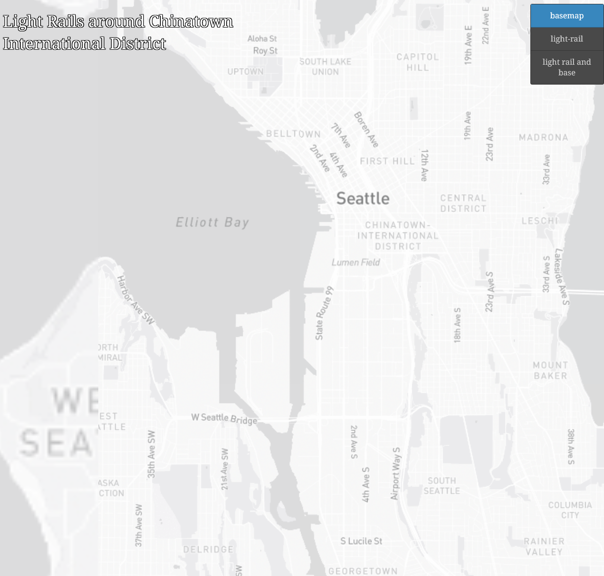
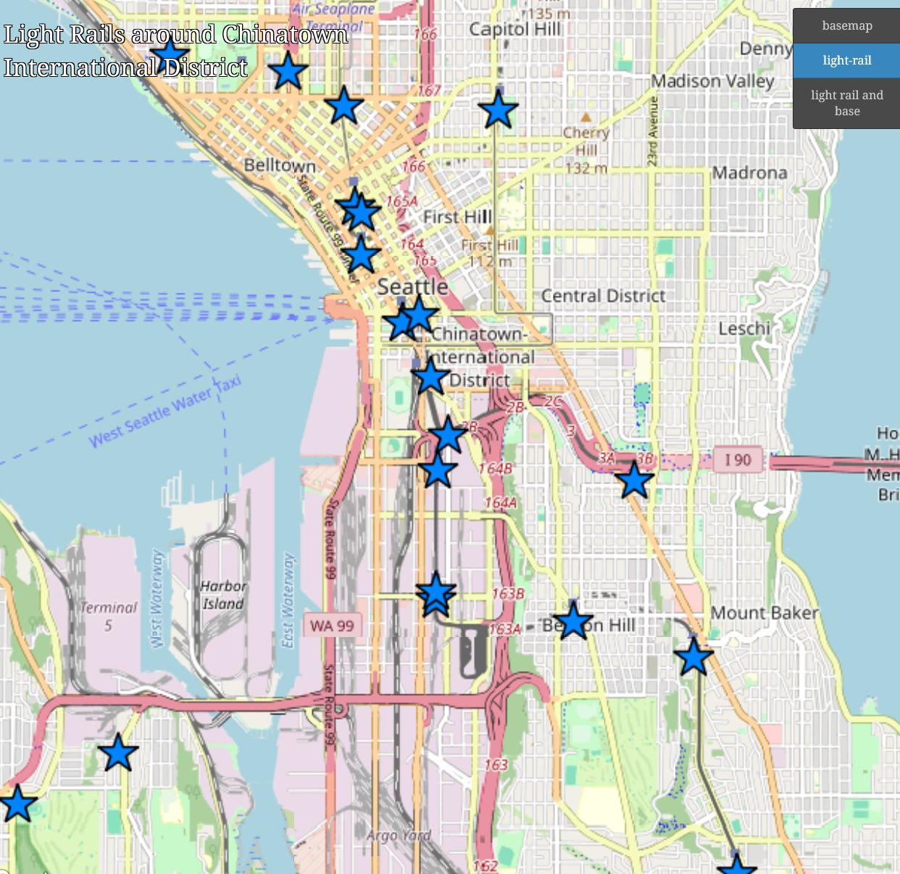

# Lab 4: Map Design and Tile Generation

## Introduction

[Map of Chinatown and Light Rails](https://kuyaji.github.io/geog-458-lab4/)

In this project, I examined Seattle, specifically Chinatown and mapped out the Light Rail stations around the area.

There are three layers available.

### Basemap

This layer shows the general area, with city and town names.

### Light Rail Stations

This layer shows all the light rail stations around Chinatown as stars.

### Light Rail Stations on Basemap

This layer shows all the light rail stations on the basemap. It is more clear here.

Disclosure: No AI tools were used in this assignment.